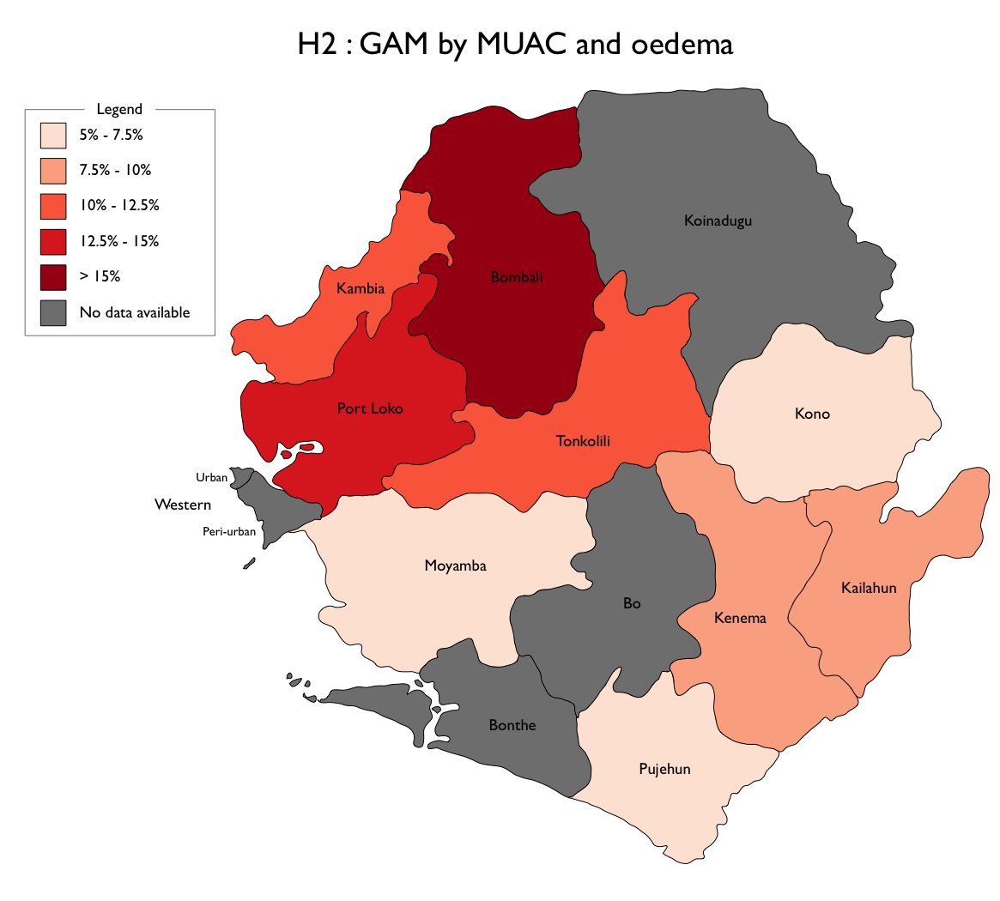
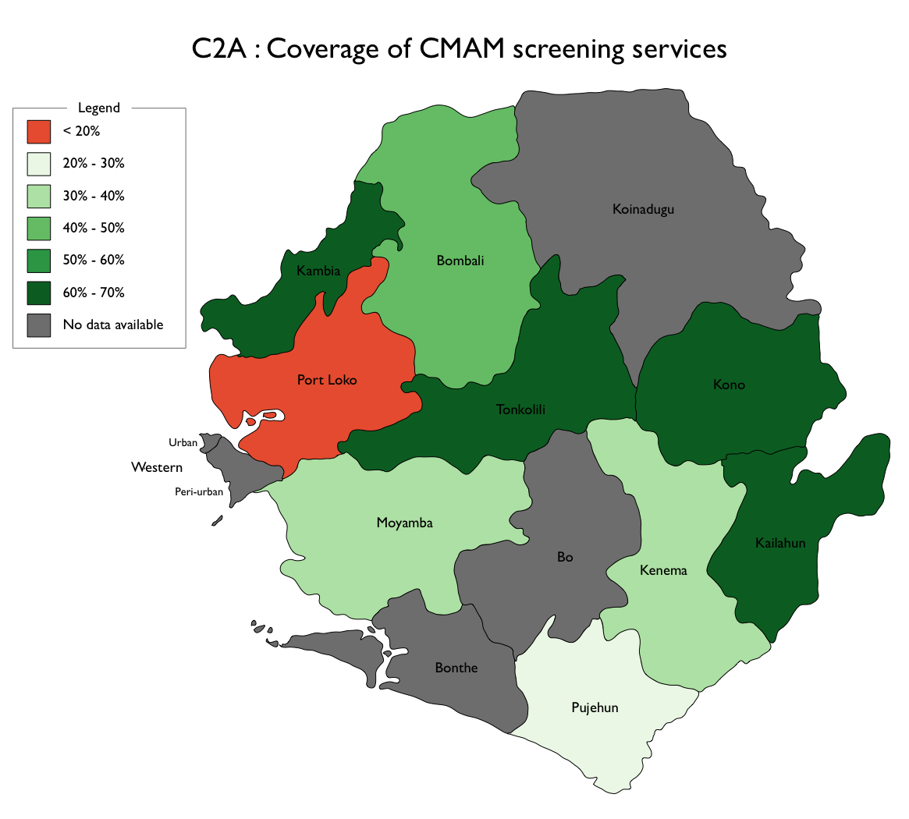
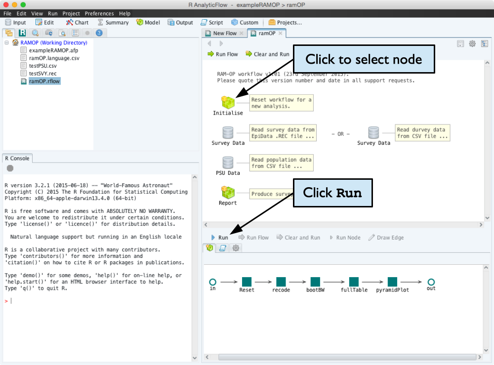
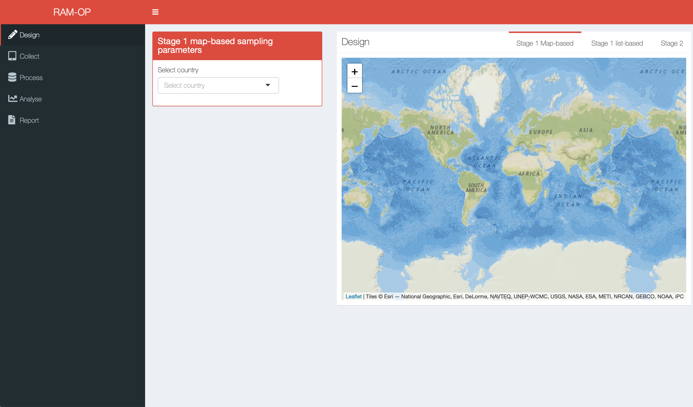

```{r setup, include=FALSE}
knitr::opts_chunk$set(echo = TRUE,
                      warning = FALSE,
                      message = FALSE)

knitr::knit_hooks$set(document = function(x) {
  sub('\\usepackage[]{color}', '\\usepackage{xcolor}', x, fixed = TRUE)
  }
)

if(!require(rgdal)) install.packages("rgdal")
if(!require(rgeos)) install.packages("rgeos")
if(!require(raster)) install.packages("raster")
if(!require(maps)) install.packages("maps")
if(!require(knitr)) install.packages("knitr")
if(!require(kableExtra)) install.packages("kableExtra")
if(!require(magrittr)) install.packages("magrittr")
if(!require(ggplot2)) install.packages("ggplot2")
if(!require(ggmap)) install.packages("ggmap")
if(!require(stringr)) install.packages("stringr")
if(!require(remotes)) install.packages("remotes")
if(!require(openxlsx)) install.packages("openxlsx")
if(!require(RColorBrewer)) install.packages("RColorBrewer")

if(!require(gadmr)) install_github("spatialworks/gadmr")
if(!require(spatialsampler)) install_github("spatialworks/spatialsampler")
if(!require(comoros)) install_github("spatialworks/comoros")

if(!require(drlib)) install_github("dgrtwo/drlib")

themeSettings <- theme_bw() +
  theme(panel.border = element_rect(colour = "gray50",
                                    size = 0.5),
        panel.grid.major = element_line(linetype = 1,
                                        size = 0.1,
                                        colour = "gray90"),
        panel.grid.minor = element_line(linetype = 0),
        strip.background = element_rect(colour = "gray50",
                                        fill = "gray70"),
        strip.text = element_text(colour = "white", size = 16),
        legend.text = element_text(size = 16),
        legend.key = element_rect(linetype = 0),
        legend.key.size = unit(0.5, "cm"),
        legend.position = "top",
        axis.title = element_text(size = 16),
        axis.text.x = element_text(size = 14),
        axis.text.y = element_text(size = 14),
        axis.ticks = element_line(colour = "gray50", size = 0.5))
```

\newpage

# Background

UNICEF Comoros is planning to conduct a national survey and would like to explore all the possible methods to use to be able to assess standard health and nutrition indicators they need for planning projects in the country. This document outlines an alternative to standard cluster surveys such as the Multiple Indicator Cluster Surveys (MICS) that are usually used by UNICEF countries.

## About Comoros

The Comoros (Union of the Comoros) is an island country on the Indian Ocean composed of three main islands (first administrative unit). The country is further dividided administratively into 17 prefectures (districts) and 55 communes (sub-districts). Figure \@ref(fig:comorosMap) below show these administrative divisions.

```{r comorosMap, echo = FALSE, eval = TRUE, fig.cap = "Map of Comoros", fig.width = 10, fig.height = 10, out.width = "90%", fig.align = "center", fig.pos = "H"}
plot(comoros::commune, lwd = 0.2, border = "gray70")
plot(comoros::prefecture, lwd = 1, border = "gray30", add = TRUE)
text(coordinates(comoros::prefecture), labels = comoros::prefecture$ADM2_EN, col = "gray50", cex = 0.5)
plot(comoros::island, lwd = 3, add = TRUE)
text(coordinates(comoros::island), labels = comoros::island$ADM1_EN, cex = 1)
```

# Proposed indicators

For purposes of health and nutrition programme planning for the Comoros, we propose the following reasonably comprehensive set of indicators as a starting point:

* Anthropometry:

    - Prevalence of:
        
        * Moderate and severe stunting (HAZ)
        
        * Moderate and severe wasting (WHZ)
        
        * Moderate and severe wasting (MUAC)
        
        * Moderate and severe underweight (WAZ)
        
        * Concurrent wasting and stunting (WHA and HAZ)
        
        * Combined GAM and combined SAM (MUAC, WHZ, oedema)

      in children 6 to 59 months.

    - Prevalence of acute energy deficiency (MUAC) in mothers / carers.

* Infant and child feeding index (ICFI) in children age 6 to 23 months extended using dietary diversity and meal frequency data in older children. 

    - ICFI provides a comprensive set of IYCF behavioural indicators and has been used in Demographic and Health Surveys (DHS).

* Dietary diversity scores for mothers (minimum dietary diversity for women or MDD-W) and children.

* Micronutrient consumption in mothers and children (from dietary diversity data) 

* Period prevalence of diarrhoea, acute respiratory infection (ARI), and fever of unknown origin (FUO) in children.

* Water, sanitation, and hygiene (WASH) indicators (Joint Monitoring Programme or JMP indicator set)

* Expanded programme on immunisation (EPI) coverage

* Vitamin A coverage

* Deworming coverage

* Bednet coverage (if appropriate to context)

* IYCF counselling coverage (and recall of IYCF messages)

* Coverage of community-based management of acute malnutrition (CMAM) screening services

* Coverage of health extension services

* Antenatal care (ANC) coverage indicators

* Access to pre-school education (childen)

* Maternal education

* Multi-dimensional Poverty Index (MPI) or other poverty indices.


Other indicators can be added. We prefer to use fully tested question sets and indicators and can advise on indicator selection. Let us know of indicators that you would like to add and we can provide specific guidance on whether these indicators will fit our approach and if not, what adaptations might be applied to these indicators to be fit for use with our approach.


# Proposed method

Given the geography of the Comoros and with what we recommend as feasible and useful indicators for the purpose of health and nutrition programming in the country, we propose the Rapid Assessment Method or RAM. Applying RAM in the Comoros will include data collected and estimates made at prefecture (district) level using small sample surveys (e.g. 16 clusters of 12 mother-child pairs selected using simple to use and well-tested stratified spatial sampling methods). Surveys can be pooled (combined) to produce estimates at wider levels (e.g. island and union level). Pooling of results will require prefecture level population data. Pooling of multiple RAM surveys can be seen as a "poor man's MICS" providing similar results both cheaply and quickly. Results can be mapped to prefecture level and above. RAM works with such small sample sizes (e.g. n = 192) because it uses modern and efficient indicators and computer intensive data analysis methods. All analysis is done using our free and open source "workflow" software.

&nbsp;

```{r sampleResults1, echo = FALSE, eval = TRUE, fig.cap = "Example results mapping from RAM surveys conducted in Sierra Leone by UNICEF", fig.align = "center", out.width = "60%"}


knitr::include_graphics("figures/i9a.png")
```

RAM has been used in Sierra Leone, Sudan, Bangladesh, Myanmar, Ethiopia, Tanzania, DRC, Malawi by UNICEF, MSF, GOAL, SC-US, Help-Age (RAM-OP), GAIN, and national governments.

\newpage

# Implementation

We have experience rolling out RAM at the national level. We usually start by training many teams and supervisors in a single district. Teams can then return to home districts to complete further surveys. A typical district survey takes less than about 4 days to complete. Data-entry, data-analysis, and reporting usually takes only one additional day to complete. All data-analysis is done using our free and open source "workflow" software which we can easily customise to meet clients' needs. We can also provide training and support for survey and software customisation.

```{r workflow1, echo = FALSE, eval = TRUE, fig.cap = "Example of a workflow system using RAnalyticFlow designed for RAM for Older People", fig.align = "center"}

```

```{r workflow2, echo = FALSE, eval = TRUE, fig.cap = "Example of a web-based workflow system designed for RAM for Older People (https://rapidsurveys.shinyapps.io/ramOP)", fig.align = "center", fig.pos = "H", out.width = "90%"}

```